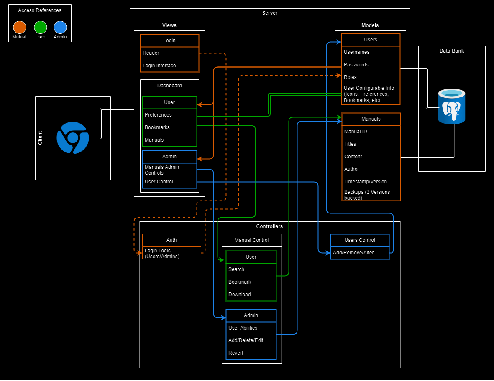

# MVC - Ponderada 2

MVC - Marcelo Conde Filho  

Fonte: Material produzido pelos autores (2024).

 

- Nome do Projeto: **Atividade ponderada 2 - Arquitetura em Esboço do MVC em Sails**
- Descrição: **MVC de um site de Manuais para uma fabrica**
- Arquitetura: **MVC (Model-View-Controller)**
- Ferramenta de Diagramação: **draw.io**

## Documentação do Sistema de Gerenciamento de Manuais

### Modelos (Models)
- **Usuários (Users)**: Responsável por gerenciar informações de usuário, como nomes de usuário, senhas, roles (que definem acessos e controles sobre manuais e outros usuários), e preferências dos usuários (bookmarks, ícones e dados de leitura).
- **Manuais (Manuals)**: Responsável pelos dados dos manuais, incluindo IDs, títulos, conteúdo, autor, versão, tempo de postagem, e backups de até três versões anteriores.

### Controladores (Controllers)
- **Autenticação (Auth)**: Gerencia o processo de autenticação de usuários no login. Após um login bem-sucedido, redireciona o usuário para o dashboard de Admin ou Usuário, dependendo do seu role.
- **Controles dos Manuais (Manual Controls)**: No dashboard ao qual o usuário tem acesso, permite que ele visualize manuais, adicione aos favoritos, e faça downloads. No dashboard de administração, adiciona funcionalidades para alterar dados dos manuais, gerenciar dados dos usuários, e reverter versões dos manuais.

### Interfaces de Usuário (Views)
- **Login**: Interface para acesso ao controlador de autenticação.
- **Dashboard (Usuário)**: Oferece acesso a preferências, bookmarks e uma lista de manuais disponíveis.
- **Dashboard (Administração)**: Fornece controle sobre os manuais, estatísticas de acesso e gerenciamento de dados dos usuários.

### Infraestrutura
#### Componentes
- **Banco de Dados Relacional**: Armazena e gerencia os dados estruturados dos modelos `Users` e `Manuals`. Essencial para operações que envolvem integridade de dados e relações complexas.
- **APIs Internas**: Implementam a lógica de negócios dos controladores e interagem com o banco de dados. Facilitam a comunicação entre o frontend e o backend.
- **Servidor Web/Frontend**: Utiliza frameworks modernos para renderizar as interfaces de usuário, consumindo dados das APIs internas.

#### Integração com a Arquitetura MVC
- **Model**: Localizado no backend, interage diretamente com o banco de dados para definir a estrutura de dados e regras de negócio.
- **View**: Construída no frontend, dinamicamente atualizada com dados processados pelo backend.
- **Controller**: Facilita a comunicação entre o Model e a View, processando as requisições dos usuários, aplicando a lógica de negócios e retornando os dados para a View.

#### Serviços Adicionais
- **Backup e Recuperação**: Sistemas automatizados para backups regulares dos bancos de dados, essenciais para a recuperação de versões anteriores dos manuais.
- **Monitoramento e Logs**: Ferramentas para monitorar a saúde e o desempenho da aplicação, além de sistemas para log de atividades para auditoria e segurança.

### Justifique as escolhas feitas e como elas impactam o projeto.
#### Implicações da Arquitetura:
#### 1. **Escalabilidade**
- **Frontend e Backend Separados**: A separação entre o servidor de aplicação e o servidor web permite que cada um seja escalado independentemente conforme a demanda. Por exemplo, pode-se adicionar mais instâncias do servidor de aplicações durante picos de carga sem alterar o frontend.
- **Banco de Dados Relacional**: Embora ofereça vantagens em termos de transações atômicas e integridade dos dados, pode se tornar um gargalo se não bem dimensionado. O uso de técnicas como sharding ou replicação pode ajudar a melhorar a escalabilidade do banco de dados.
- **Uso de Caches e Load Balancers**: Implementação de cache para dados frequentemente acessados e load balancers pode distribuir a carga, melhorando a resposta do sistema em cenários de alta demanda.

#### 2. **Manutenção**
- **Modularidade do MVC**: A clara separação de responsabilidades facilita a atualização e manutenção de partes específicas do sistema sem impactar outras. Por exemplo, mudanças na lógica de negócio (Controller) ou na interface do usuário (View) podem ser feitas independentemente.
- **Documentação e Normas**: A estrutura bem definida e documentada facilita a onboarding de novos desenvolvedores e reduz o risco de erros durante manutenções, pois as funções e os fluxos de dados são claramente delineados.

#### 3. **Testabilidade**
- **Isolamento de Componentes**: Cada componente do MVC pode ser testado

isoladamente. Isso permite a implementação de testes unitários para modelos (Model), controladores (Controller) e visões (View) de maneira eficaz. Além disso, a separação entre lógica de negócios e interface facilita a criação de testes automatizados, incluindo testes de integração e testes de interface de usuário.
- **Mocking e Stubs**: Facilitados pela arquitetura MVC, o uso de objetos simulados (mocks) e stubs nos testes permite validar componentes de maneira independente, sem a necessidade de interação com bancos de dados ou serviços externos, aumentando a velocidade e eficácia dos testes.

#### 4. **Segurança**
- **Autenticação e Autorização Centralizadas**: A centralização dessas funcionalidades no controlador `Auth` ajuda a garantir que as políticas de segurança sejam aplicadas de forma consistente em toda a aplicação. Isso reduz o risco de brechas de segurança devido a implementações inconsistentes.
- **Princípios de Menor Privilégio**: A implementação de diferentes roles de usuário no sistema garante que cada usuário tenha acesso apenas às funcionalidades necessárias para suas tarefas, minimizando possíveis danos em casos de acesso indevido.

#### 5. **Desempenho**
- **Desacoplamento**: A arquitetura desacoplada permite otimizações específicas em cada camada sem afetar outras partes do sistema. Por exemplo, a otimização de consultas de banco de dados ou a implementação de técnicas de lazy loading nas views podem melhorar significativamente o desempenho.
- **Cache de Dados**: O uso de cache para dados frequentemente acessados, como informações de login ou dados de manuais populares, pode reduzir a carga sobre o banco de dados e acelerar a resposta do sistema para os usuários finais.

### Recursos Adicionais:
Documentação do Sails.js: https://github.com/balderdashy/sails
Tutorial do draw.io: https://m.youtube.com/watch?v=w3zm-wbmlpc
Exemplos de diagramas MVC: https://www.lucidchart.com/pages/templates

